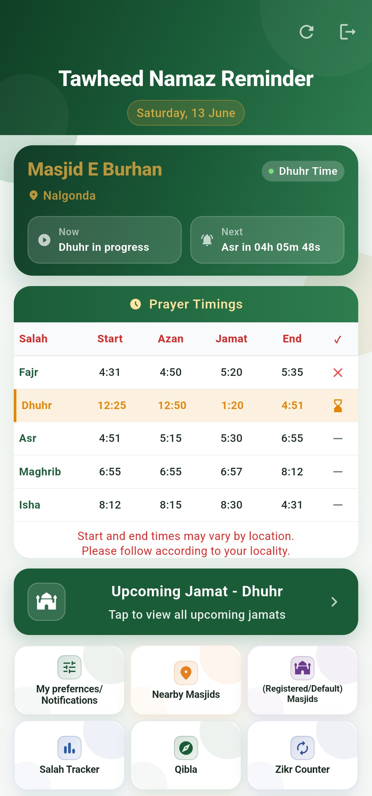
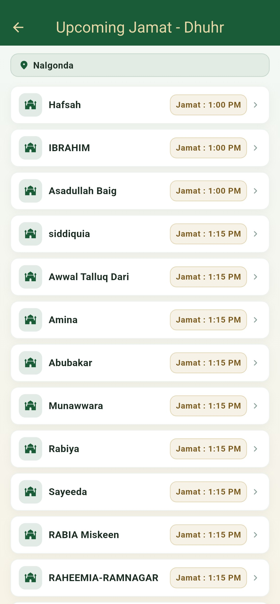
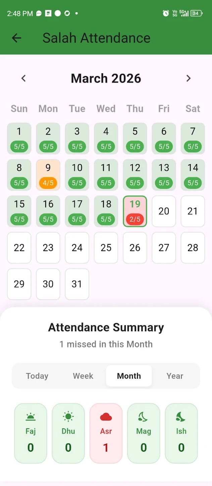
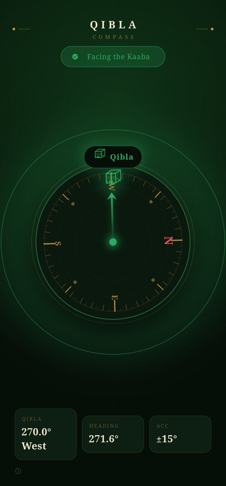

# Tawheed Namaz Reminder

**Your Namaz • Your Masjid • Your Connection**

Tawheed Namaz Reminder is a Flutter-based Islamic application designed to help Muslims maintain punctuality in Salah and stay connected with their local masjid. The app provides prayer time notifications, Jamaat reminders, prayer attendance tracking, nearby masjid discovery, Qibla direction, Masnoon Duas, Zikr Counter, and other useful Islamic features.

## Features

### Prayer Timings Dashboard

* Daily prayer timings
* Azan time, Jamaat time, and end time
* Current prayer status
* Next prayer countdown

### Azan & Jamaat Notifications

* Prayer reminders
* Jamaat reminders
* Accept, Decline, and Snooze options
* Individual notification controls

### Salah Tracker

* Daily, weekly, monthly, and yearly reports
* Prayer attendance tracking
* Qaza prayer management

### Upcoming Jamaat Finder

* View upcoming Jamaat timings in nearby registered masjids
* Quick navigation to selected masjid

### Nearby Masjid Finder

* Discover masjids within a 10 KM radius
* Distance and navigation support

### Personalized Prayer Timings

* Customize prayer timings according to your routine
* Reset to default masjid timings anytime

### Change Default Masjid

* Switch home masjid when travelling
* Receive notifications based on the selected masjid

### Masnoon Duas

* Arabic text
* Roman English
* Roman Telugu

### Zikr Counter

* Digital tasbeeh counter
* Custom zikr support
* Sound and vibration controls
* Target-based counting

### Qibla Finder

* Accurate Qibla direction
* Compass calibration support

### Namaz Guide

* Namaz Rakats Guide
* Namaz Ka Tariqa
* Eid Namaz Guide
* Janaza Namaz Guide
* Nafl Namaz Information

## Technology Stack

* Flutter
* Dart
* Android
* Location Services
* Local Notifications

## Screenshots

## Screenshots

| Home Screen | Upcoming Jamaat |
|-------------|----------------|
|  |  |

| Salah Tracker | Qibla Finder |
|---------------|-------------|
|  |  |


## Installation

1. Clone the repository
2. Run:

```bash
flutter pub get
```

3. Start the application:

```bash
flutter run
```

## Google Play Store

Download the app from Google Play Store:

[Google Play Store](https://play.google.com/store/apps/details?id=com.tawheed.namazreminder&pcampaignid=web_share)

## Author

Abdul Mueed Mohammed

---

Built to help Muslims stay connected to Salah and their local masjid.
